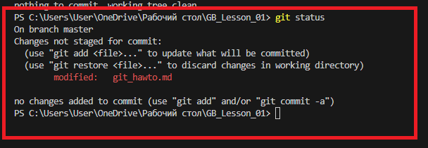
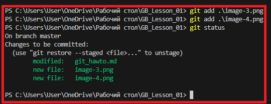
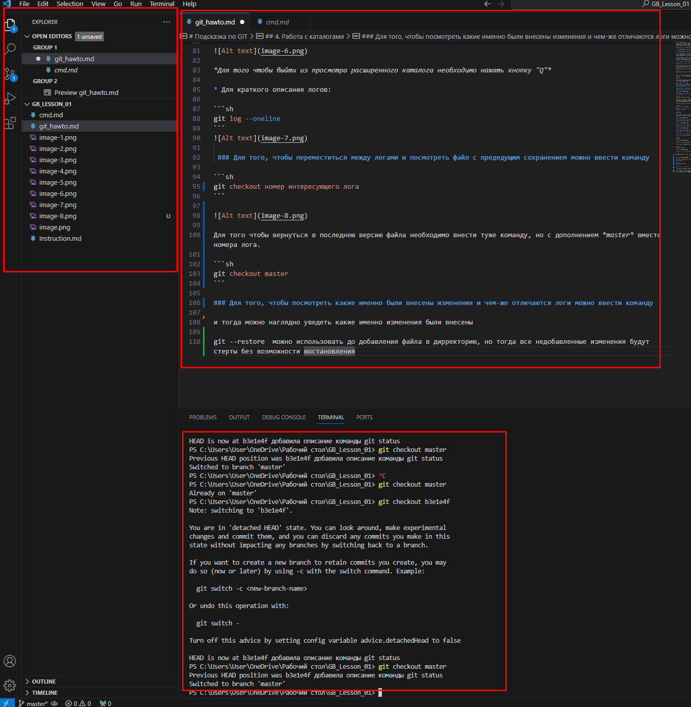

# Подсказка по GIT
Git - это программное обеспечение, помогающее разработчикам управлять состоянием исходного кода на протяжение всей разработки. Другими словами, это система, которая записывает ваши изменения в файл и позже позволяет откатиться к более ранней версии проекта.

Системы контроля версий можно разделить на две группы:

1. Централизованные системы контроля версий;

2. Распределенные системы контроля версий.

**Централизованная система контроля версий** - это система, при которой репозиторий проекта хранится на сервере и вносить изменения вы можете непосредственно только в этот репозиторий при помощи специальных клиентских приложений. Среди таких систем можно выделить: ClearCase, TFVC, SVN.

**Распределенная система контроля версий** - это система, при которой копия репозитория может храниться на машине у каждого разработчика, что значительно снижает риск потерять результат работы над проектом. Примером таких систем могут быть: Git, Mercurial, Bazaar

***Git является распределенной системой контроля версий***

## Команды для работы с GIT

### 1. Добавление имени пользователи и почты
Для добавления имени пользователя и почты необходимо использовать две команды:
```sh
git config user.name "Имя Фамилия"
```
```sh
git config user.email "почта@gmail.com"
```

### 2. Подготовка репозитория
Для того чтобы проинициализировать Git директорию в своем проекте необходимо ввести команду:
```sh
git init
```
Это создаст в каталоге новый подкаталог .git со следующим содержанием:


## 3. Работа с историей
### Для того чтобы записать наш файл и изменения в нем нам необходимо для начала нажать сохранение файла в боковом меню кликнув правой кнопкой мыши по необходимому файлу или нажать сочетание клавишь на *Windows* **ctrl+S** или на *MacOS* **Command+O** - это делается для того, чтобы Git понял, что в файле произошли изменения. 

**Чтобы понять сохранен файл или нет достаточно взглянуть на шапку файла и если файл не сохранен, то рядом с названием будет белая точка.**


### Далее после сохранения необходимо ввести команду которая позволит сообщить Git какие именно изменения должны быть занесены в историю

```sh
git add наименование файла
```
Для того, чтобы быстро внести имя файла в команду необходимо прописать начало наименования файла и нажать кнопку Tab, после терминал сам пропишет полное наименование файла и командная строка будет выглядить например так: *PS C:\Users\User\OneDrive\Рабочий стол\GB_Lesson_01> git add .\git_hawto.md*

### после добавления необходимо ввести команду которая позволит сохранить изменения в историю проекта

```sh
git commit - m "message"
```
### Для того чтобы проверить статус файла и посмотреть или убедиться, что все сохранения были добавлены можно прописать команду 

```sh
git status
```
**Если изменения были внесены, но не добавлены в дирректорию, то после введении команды *git status** выдаст информацию в следующем виде:**



**Если ВСЕ изменения были добавлены в дирректорию с помощью команды *git add*, то после введении команды *git status* выдаст информацию в следующем виде:**



**Если в дирректорию были добавлены НЕ все измененияс помощью команды *git add*, то после введении команды *git status* выдаст информацию в следующем виде:**


## 4. Работа с каталогами
### log Каталог хранит в себе историю проекта для всех веток в вашем проекте.

**Чтобы посмотреть каталог логов можно прописать две команды:**

* Для рассширенного описания логов:

```sh
git log
```


*Для того чтобы выйти из просмотра расширенного каталога необходимо нажать кнопку "Q"*

* Для краткого описания логов:

```sh
git log --oneline
```


 ### Для того, чтобы переместиться между логами и посмотреть файл с предедущим сохранением можно ввести команду

```sh
git checkout номер интересующего лога
```


Для того чтобы вернуться в последнею версию файла необходимо внести туже команду, но с дополнением *master* вместо номера лога. Таким обращом можно перемещаться между логами.

```sh
git checkout master
```


### Для того, чтобы посмотреть какие именно были внесены изменения и чем-же отличаются логи можно ввести команду 

```sh
git diff
```
и тогда можно наглядно уведеть какие именно изменения были внесены


*Для того чтобы выйти из просмотра необходимо нажать кнопку "Q"*

## 5. Удаление не добавленных изменений 

### Для удаления не добавленных измнений можно сипользовать команду 

```sh
git --restore  
```

Нужно быть осторожнее с этой командой т.к. тогда все недобавленные изменения будут стерты без возможности востановления.
